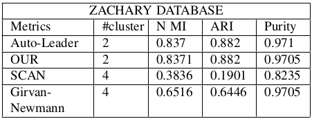
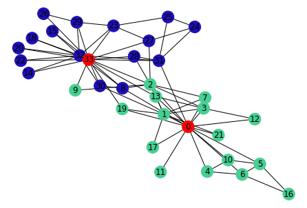
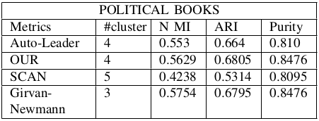
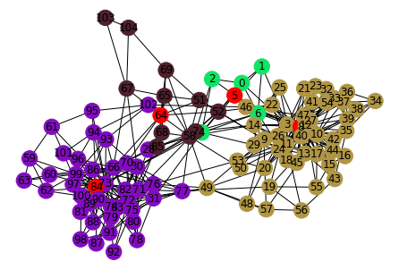
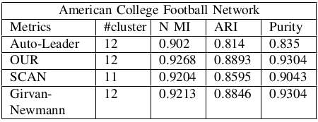
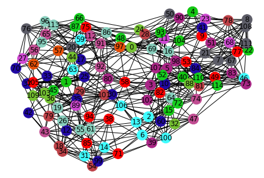

# Community Detection In Complex Network Using Leader Knowledge

> This file, "README.md" is created in markdown format. To view, this file, either install a [google chrome extension](https://chrome.google.com/webstore/detail/markdown-viewer/ckkdlimhmcjmikdlpkmbgfkaikojcbjk?hl=en) or check it on [github](https://github.com/weasel-codes/community-detection-using-leader-knowledge).

This document consists of guide to run the code files and details about working environment that have been submitted as our work to the WSC project work.

Following sections are divided as follows : 

* Folder Structure : gives insight on how files are arranged in this submission inside `Report`, `Datasets`, `Software`, `Source_Code` and `Images` sub folders.

* Working Environment : gives insight on what is needed for setting up the system.

* Libraries : insight on libraries used in project code.

* HOW TO Run Code Files? : details on how to run code files.

* Results : result of project work

* References consist of single link linking to github repo where all code is made available.

## Folder Structure

### Report
This directory consists of 3 files :
* ```Report/Group_6_WSC_Presentation.pptx``` : File containing presentation that was delivered during final project work presentation.
* ```Report/Group_6_WSC_Report.pdf``` : This consist of pdf version of report created in latex format describing work performed in the project. Last page of report consist of plagarism report.
* ```Report/Group6_WSC_Report.zip``` : a zipped folder containing files required to generate latex report.

### Datasets
We have used three datasets for our project work :

* [American Football](http://konect.cc/networks/dimacs10-football/) : This network contains "American football games between Division IA colleges during regular season Fall 2000." Results are not included in the dataset, and neither is home/away information. 

* [Zachary](http://konect.cc/networks/ucidata-zachary/) : This is the well-known and much-used Zachary karate club network. The data was collected from the members of a university karate club by Wayne Zachary in 1977. Each node represents a member of the club, and each edge represents a tie between two members of the club. The network is undirected. An often discussed problem using this dataset is to find the two groups of people into which the karate club split after an argument between two teachers. 

* [Political books](http://konect.cc/networks/dimacs10-polbooks/) : This is "a network of books about US politics published around the time of the 2004 presidential election and sold by the online bookseller Amazon.com. Edges between books represent frequent copurchasing of books by the same buyers. The network was compiled by V. Krebs and is unpublished, but can found on Krebs' [web site](http://www.orgnet.com/). Thanks to Valdis Krebs for permission to post these data on this web site."

Out of these datasets, `Zachary` dataset is directly imported from `networkx` library while other two are shared as :
* ```Datasets/football.csv``` : Edge dataset for American Football dataset
* ```Datasets/polbooks.csv``` : Edge dataset for Political Book dataset

### Software
This was supposed to contain softwares required for running project work but since there is no as such specific software required, this folder is empty.

### Source_Code
Our source code is divided into 3 parts performing three objective of our project work. Here are the deatils :

* ```Source_Code/WSC_Implementation.ipynb``` consist of code containing impllementation of Updated Autoleader algorithm and its performance evaluation using metrics NMI, ARI and cluster purity.

* ```Source_Code/WSC_Implementation_Models.ipynb``` consist of code containing implementation of SCAN and Girvan Newmann algorithm using `cdlib` library. This also contains code for performance evaluation of both of these algorithms using metrics NMI, ARI and cluster purity.

* ```Source_Code/WSC_Implementation_Plot.ipynb``` deals with printing of clusters obtained in ```Source_Code/WSC_Implementation.ipynb``` .

### Images
This folder consist of images required to create this readme document.

## Working Environment
* Programming language : Python
* Programming platform : Google Colaboratory

```All code is written and is to be tested over  google colab. All code files have code written to import and handle all the depedencies and libraries. Hence, libraries mentioned below are not required to be sent in project package but are mentioned here just for reference.```

## Libraries Needed
Python packages you need to install. The list of libraries that we have used here are :

* [NumPy](https://numpy.org/install/) - NumPy is an open-source numerical Python library.

* [Pandas](https://pandas.pydata.org/docs/reference/index.html) - Python Data Analysis Library.

* [Matplotlib](https://matplotlib.org/stable/tutorials/introductory/usage.html#sphx-glr-tutorials-introductory-usage-py) - Library for creating static, animated, and interactive visualizations.

* [Cdlib](https://cdlib.readthedocs.io/en/latest/) : CDlib is a Python software package that allows to extract, compare and evaluate communities from complex networks.

* [Networkx](https://networkx.org/documentation/stable/tutorial.html) : NetworkX is a Python package for the creation, manipulation, and study of the structure, dynamics, and functions of complex networks.

* [Random](https://docs.python.org/3/library/random.html#module-random) : This module implements pseudo-random number generators for various distributions. For integers, there is uniform selection from a range. For sequences, there is uniform selection of a random element, a function to generate a random permutation of a list in-place, and a function for random sampling without replacement.

## HOW TO Run Code Files?
### Task1 : Updated Autoleader Algorithm
* Upload file ```WSC_Implementation.ipynb``` on Google-colab. 
* This file contains code for updated autoleader algorithm and its performance testing on all three datasets.
* Upload ```polbook.csv``` and ```football.csv``` dataset files for polbook and football dataset.
* Dataset for ```Zachary Karate club``` is available in the networkx library itself and we have used that one only so no need to upload files for that.
* Run the whole colab file by clicking `runtime > run all` from menu bar on Google-colab.

### Task2 : Scan and Girvan Newmann
* Upload file ```WSC_Implementation_models.ipynb``` on Google-colab. 
* This file contains code for `SCAN` and `Girvan-Newmann` algorithms and their performance testing on all three datasets.
* Upload ```polbook.csv``` and ```football.csv``` dataset files for polbook and football dataset.
* Dataset for ```Zachary Karate club``` is available in the ```networkx``` library itself and we have used that one only. So no need to upload files for that.
* Run the whole colab file from `runtime > run all`.

### Task3 : Plotting graphs
* Upload file ```WSC_Implementation_plot.ipynb``` on Google-colab. 
* This file contains code for plotting clusters obtained after running an updated autoleader algorithm.
* Run the whole colab file from `runtime > run all`. There is no other dependency required for this.

## Results
Here are the observations from the results obtained :
* It was observed that in case of Zachary dataset,
both Autoleader and our implementation provide
better results than SCAN and Girvan Newmann.
* In case of Football and Polbook dataset, our
implementation, if not better, is at least as good
as any of the other algorithm.
* Nodes marked in red are leader nodes of clusters and same color of nodes is representing different nodes belonging to same cluster.

### Zachary
* Table showing result for Zachary dataset : 

<br />



<br />

* Clusters found after running updated autoleader :

<br />



### Polbooks
* Table showing result for Polbooks dataset : 

<br />



<br />

* Clusters found after running updated autoleader :

<br />



### Football
* Table showing result for Football dataset : 

<br />

<br />

* Clusters found after running updated autoleader :

<br />



## Authors

| Name                    | Roll Number |
|-------------------------|-------------|
| Abhishek Kumar          | 202IT001    |
| Mohd Asif Khan Khaisagi | 202IT013    |
| Nitin Sharma            | 202IT017    |

## References
* [Github link](https://github.com/weasel-codes/community-detection-using-leader-knowledge) where project is present and can be referred for future work.